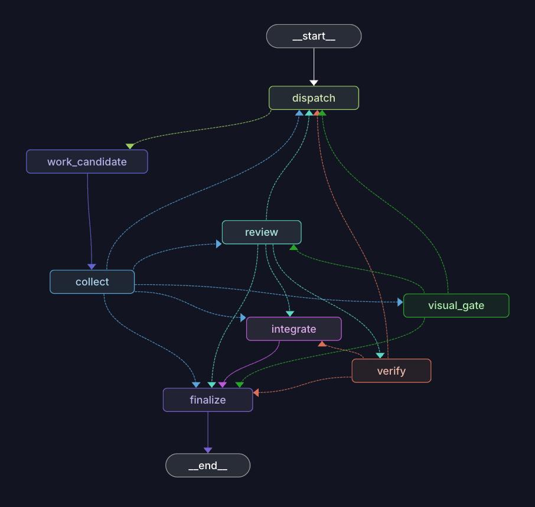

# agent-studio

A **project-agnostic multi-agent development orchestrator** on LangGraph 1.x.
The core knows nothing about any particular language, framework, or repo —
every project-specific detail (paths, gate commands, worker models, coding
protocol) lives in a per-project profile and prompt overlay. The committed
template is `config/projects/example.yaml`; the real, machine-specific profile
lives in the **gitignored** `projects/<name>/profile.yaml` (with optional
prompt overrides in `projects/<name>/prompts/`). The loader reads the new path
first and falls back to the legacy `config/projects/<name>.yaml`.



<sup>The task graph, as LangGraph Studio renders it from `orchestrator/engine/graph.py`. Solid
edges are unconditional; every dashed one is a router. Each arrow back into `dispatch` is a
retry, an escalation, or a reviewer's `revise`.</sup>

## The economic model

Two tiers of intelligence, priced accordingly:

| Role | Model | Channel | Cost |
|---|---|---|---|
| Planner (tech-lead) | Opus **or** GPT-5.6 | Claude Code CLI / Codex CLI | subscription (weekly limit) |
| Reviewer (rubric) | Opus **or** GPT-5.6 | Claude Code CLI / Codex CLI | subscription |
| Workers | DeepSeek V4 Flash / GLM / Kimi | CometAPI (OpenAI-compatible) | cents |
| Escalation senior | subscription Opus/Sonnet or GPT-5.6 | CLI (patch→gate, not repo edits) | subscription |
| Scheduler, Gate, Integrator, Retrieval, Visual gate | — | pure Python + git | **zero** |

The whole **smart tier** (planner + reviewer) is one config switch,
`roles.smart_provider: claude_cli | codex_cli` — flip it to A/B Claude vs Codex;
the cheap CometAPI workers are untouched either way.

The design maximizes quality-per-token:

- **Workers get a tiny, explicit context.** No filesystem, no tools. They see
  the task spec, a distilled protocol excerpt, and the exact files the planner
  listed — nothing else. The planner's `files_read` list *is* the worker's
  entire world; authoring it well is the single most important act in the
  system, which is why the planner is Opus.
- **The gate is deterministic and free.** typecheck/lint/test/build run as
  subprocesses in the candidate's worktree. Broken code never reaches the
  Opus reviewer; failure logs go straight back to the cheap worker.
- **The reviewer only sees green diffs.** Narrow context applies to Opus too:
  the reviewer sees spec + diff, never the queue; the planner sees the
  backlog, never the diffs.

## Architecture

```
 orchestrator discuss ─► PLANNER tech-lead (multi-turn: asks, pushes back) ─┐
 orchestrator plan  ──►  PLANNER (Opus/GPT-CLI): backlog ─► enriched specs ─┴─► SQLite store
                                                          │  (+ project map inserted for context)
 orchestrator run   ──►  SCHEDULER (pure py): deps toposort + files_write-disjoint batches
                                                          │  per task, parallel
                                              ┌───────────▼───────────┐
                                              │  LangGraph task graph  │  thread_id = run:task
                                              │                        │  SqliteSaver checkpoints
        dispatch ──Send fan-out──► work_candidate(×N) ──► collect      │
           ▲   (candidates: ds_v4_flash/glm/kimi in their own worktree;│
           │    warm chat + read-only retrieval; LLM ─► patch ─► GATE) │
           ├── retries (≤ max_retries), feedback = raw gate log        │
           │                          green │ + visual? ─► VISUAL GATE  │
           │                                │ (scene assertions)        │
           ├── escalate (exhausted) ─► SENIOR (subscription, patch→gate)│
           ├── review says "revise" ◄── REVIEWER (rubric, diff only)   │
           │                                        │ approve          │
           │                              INTEGRATOR (pure py + git):  │
           │                              merge winner ─► feature branch│
           │                              backlog writeback + PROJECT   │
           └──────────────────────────────MAP regen ─► finalize        │
                                              └────────────────────────┘
```

Git ownership: **the orchestrator owns `agents/feature`** — candidate
branches merge into it automatically after green gate + approval. Merging
`feature → main` (and release tags) is a human/separate-agent decision, on
purpose.

## Setup

```bash
cd agent-studio
python -m venv .venv && source .venv/bin/activate
pip install -e ".[dev]"
cp .env.example .env      # add your COMETAPI_KEY
# Claude Code CLI must be installed and logged in (subscription auth):
claude --version
```

`.venv/` is gitignored and its interpreter is a symlink to the machine that
created it, so a cloned checkout that appears to contain one will not run — always
create a fresh venv as above (`pytest` then passes from a clean install).

Copy `config/projects/example.yaml` to `projects/<yourname>/profile.yaml`
(the whole `projects/` tree is gitignored — real profiles, prompt overrides,
and the generated project-map live there and never touch the harness repo).
Fill in the real values (or leave paths null and set them in
`config/local.yaml`, see `config/local.yaml.example`), and verify worker model
ids/prices against your provider's current list — aggregator ids rotate. Per-
project prompt overrides go in `projects/<name>/prompts/*.md` and win over the
shared `config/prompts/` templates.

To A/B the smart tier with Codex, install the Codex CLI (logged in) and set
`roles.smart_provider: codex_cli`; set `run.escalate_model` to a GPT-5.6 id so
escalation co-varies with the provider.

## Usage

```bash
# 1. Register backlog items as stubs (no LLM):
python -m orchestrator import-backlog --project example

# 2. Enrich into executable specs (the tech-lead planner reads the repo; this is
#    where files_read/files_write/deps/agent_able/complexity/risk get authored):
python -m orchestrator plan --project example
#    Planner cost is per INVOCATION (~400k tokens of repo exploration), not per
#    task, so plan a milestone's worth in one call — ~8-9x cheaper per task:
python -m orchestrator plan --project example --all-needs-plan --limit 10
#    ...or hold a multi-turn requirements conversation (it asks, pushes back,
#    then persists the plan on your approval):
python -m orchestrator discuss --project example "add rate limiting to the API layer"
#    (one-shot plan exits asking you to `discuss` if the request is ambiguous)

# 3. See what would happen (waves, candidates, file lists — zero tokens):
python -m orchestrator run --project example --dry-run

# 4. Execute:
python -m orchestrator run --project example
python -m orchestrator run --project example --tasks T-120,T-121 --n 3   # best-of-3

# 5. Observe / continue:
python -m orchestrator status --project example
python -m orchestrator metrics --project example   # solve rate, escalations, quota/task
python -m orchestrator resume --project example    # after a limit/budget pause
```

(`example` above is a placeholder project name — swap in whatever you named
your `projects/<name>/profile.yaml`.)

## Graph UI (LangGraph Studio)

An n8n-style visual view of the task state machine — nodes, edges, live
runs, and state inspection at every step:

```bash
pip install -e ".[studio]"          # langgraph-cli[inmem]; needs Python 3.11+
ORCH_PROJECT=example langgraph dev  # local server + Studio in the browser
```

`langgraph dev` serves the graph from `orchestrator/studio.py` (wired via
`langgraph.json`) with hot reload and opens LangSmith Studio connected to
your local server. The Studio UI needs a free LangSmith login; set
`LANGSMITH_TRACING=false` in `.env` if you want nothing to leave your
machine. Without `ORCH_PROJECT` the graph is view-only topology; with a
project profile you can invoke a single task straight from the UI against
the real store/repo.

## Control panel

`serve` exposes the read layer and job control over HTTP:

```bash
pip install -e ".[dev,api]"
python -m orchestrator serve --project example   # 127.0.0.1:8787, schema at /openapi.json
```

[agent-studio-ui](https://github.com/NorthernPlatanus/agent-studio-ui) is a React
panel on top of that API — planner conversation, task pipeline, live jobs over
SSE, usage ledger. Separate repo, and optional: `[api]` is an extra, and the
orchestrator plans and runs headless without it.

The API has **no authentication** and binds to loopback deliberately. Do not move
it off `127.0.0.1` without putting something in front of it.

## Key behaviors

**Best-of-N** (`run.n_candidates` or `--n`, or per-task by the planner): the
same task goes to N cheap models in parallel worktrees; the free gate culls
broken candidates; the Opus reviewer picks the winner among green diffs. One
Opus call buys N independent implementations.

**Retries**: gate failure sends the raw log back to the same worker
(`max_retries` cap). Review "revise" retries only the winner with the review
notes. Review "reject" means the *spec* is broken — the task goes back to
humans/planner, not to a worker loop.

**Read-only retrieval**: workers can't edit or run anything, but they can
*find their own context*. Instead of a patch they may emit `<grep>`, `<read>`,
or `<ls>` (plain text — no tool-calling API needed); the orchestrator runs them
read-only in the worktree and pastes results back, bounded by
`run.retrieval_rounds`. `<need_files>` is kept as an alias. This cuts the
planner's burden to author a perfect `files_read`; a high retrieval count still
logs a `retrieval` / `retrieval_exhausted` signal that the spec was thin.

**Cache-aware warm loop**: each worker (and its retries) is a single warm chat
whose big prefix — system + protocol + sorted `files_read` — is byte-stable, so
CometAPI prefix caching bills retries at the cached input rate (~5–6× cheaper).
Feedback and retrieval results append as later turns; the prefix is never
mutated. The reviewer payload is stable-first for the same reason (spec and
acceptance ahead of the volatile diffs, candidates in sorted order), so a
`revise` round re-sends a byte-identical head. `usage` records
`cache_hit_tokens`/`cache_miss_tokens` for every tier — including the CLI
providers, where the Anthropic-shaped `usage` splits input across fresh /
cache-creation / cache-read buckets — and `status` prints both plus a hit rate.

**Session reuse** (`run.session_reuse`, on by default): a `discuss` loop
otherwise re-sends backlog + project map + every current spec on every turn.
Measured on a pre-alpha test run, that payload is 47k tokens, and because the agentic loop
re-sends its prefix at every step one operator message billed 326k input tokens.
With reuse on, the Claude CLI planner pins one session (`--session-id`) and
continues it (`--resume`), so later turns send only the human's new answer.
Scoped per discuss run and closed at the end, so the planner never inherits an
unrelated run's context; a failed resume falls back to the full payload
automatically.

**Session expiry + handoff** (`providers.claude_cli.session_max_idle_s`, 50 min):
resuming is cheap only while the conversation's prefix is still in Anthropic's
prompt cache (1h TTL). Past it a resume replays the whole conversation at
cache-write weight — worse than starting over. So a session idle longer than the
window is abandoned, and what carries into the fresh one is a **digest** written
at the end of each turn (assumptions, open questions, proposed spec ids) plus a
full snapshot on disk that the planner reads *only if* the digest is
insufficient. Costs ~200 tokens instead of replaying a dead conversation. See
`orchestrator/ops/handoff.py`. The API's own idle TTL is derived from this window
(`DEFAULT_SESSION_MAX_IDLE_S + 15 min`) so a chat is never reaped while it is
still warm and resumable.

**Payload budgets**: the planner prompt is assembled to fit, never sliced.
Completed backlog items are collapsed to their id, a 160-char head, and any
cross-references rescued from the dropped tail (on a pre-alpha test board:
33k → 21k chars, with every id and every open item byte-identical). The
current-specs block
lists every spec in slim form first — an id the planner cannot see is an id it
will reuse — then spends leftover budget promoting the in-play ones to full
detail, so the block is always valid JSON.

**Escalation ladder**: the cheap worker iterates on a warm cache up to
`run.max_fix_rounds`; if it still can't land the task and
`run.escalate_on_exhaustion` is on, the task escalates to a **subscription
senior** (Opus/Sonnet or GPT-5.6) — cash cost $0. The senior implements through
the same patch→gate channel (it never edits the repo directly), routed as a
`dispatch` branch so `Send` still originates only from the fan-out. "Can't land
it" covers both shapes of stuck: a red gate, **and** a green gate the reviewer
keeps sending back with `revise`. It then gets `run.senior_fix_rounds` (default
1) retries of its own, fed the gate log — the most expensive tier used to get one
shot and could lose it to a missing import.

An attempt in which every candidate returned no `<file>`/`<edit>` blocks at all
(prose, a question) is refunded rather than charged against the retry ceiling —
nothing was attempted. Bounded by `run.max_unproductive_attempts` (default 2) and
counted as `no_patch` in `metrics`, since a rising count is a prompt problem.

**Risk routing** (opt-in): the planner labels every spec with `risk` and
`complexity`. `run.auto_integrate_low_risk` merges a green, low-risk,
single-candidate task without a reviewer call (logged as `auto_integrated`;
never applied to `visual: true` specs). `run.senior_first_for_high_risk` sends
`risk: high` / `complexity: l` specs straight to the subscription senior instead
of spending the cheap ladder first. Both off by default — they trade
verification or cheap attempts for subscription quota.

**Domains**: the planner tags each spec with a `domain` ("physics", "render",
"seam", ...). A domain can override the worker pool and inject a domain-specific
protocol excerpt (`domains:` in the profile). This is a specialization layer;
the scheduler still enforces files_write-disjointness regardless of domain.

**Asset ops** (optional, `asset_ops:`): some tasks need a real binary-processing
tool run against a file — decimating a `.glb` with gltf-transform, transcoding a
texture — and no LLM role here can do that: workers are patch-only with no shell
*by design*, and the planner/reviewer tier is Read/Grep/Glob. So the commands are
**named, human-authored and fixed** in the profile, at the same trust level as
`gate.commands`, and a spec references one **by name** (`asset_op:
reduce_ae86_poly`). The name is the only part an LLM ever writes; an unknown name
is rejected at plan time and, if it somehow reaches a candidate, fails it rather
than silently doing nothing. The op runs once per attempt in the candidate's own
worktree, after the worker's patch commit and before the gate (so the gate builds
against the processed asset), and its outputs are committed into the candidate's
diff for review and merge. A non-zero exit or a timeout fails the candidate
exactly like a red gate, counted as `asset_op_failed` in `metrics`. Empty by
default — no entries and no spec naming one is a no-op.

**Visual gate** (optional, `visual_gate.enabled`): for `visual: true` specs, a
green gate isn't enough ("compiles" ≠ "renders"). The gate optionally starts the
app in the worktree (`run_cmd`, polled until `ready_probe` answers), runs
`facts_cmd` — any headless script that prints a JSON object of scene facts, e.g.
a three.js scene walk or `blender --background --python dump.py` — and evaluates
restricted assertions over it (e.g. `scene.visibleMeshCount > 0`) with a
node-allowlisted AST walker, never `eval`. A failed assertion, a crashed
inspector, or non-JSON output marks the candidate `visual_failed` and loops it
back through the normal retry. Enabled with **no** `facts_cmd` configured, the
gate passes through and logs `visual_gate_skipped` — nothing was asserted, and
the ledger says so rather than reporting a green visual check.

**Scene verdict** (optional, `verify.enabled`): once per task, on the winning
candidate, after an approving review — a smart-tier agent drives a read-only
scene inspector over MCP and answers the question assertions can't ("is anything
wrong that nobody thought to assert?"). It attaches to the running app and
**cannot reload it**, so a criterion about the first frame, a transient or a
one-shot event is unobservable by construction: the verifier reports those as
`unverifiable` and the task ends as `needs_human` with them named, instead of
retrying at ~400k subscription tokens per attempt for a verdict it can never
reach (measured: ~800k spent on one such task). Keep `visual: true` for
steady-state appearance — the planner prompt says so — and prove transients with
unit tests.

**Project map**: after each successful merge the integrator regenerates a cheap,
deterministic structural index (tree + module→symbols) into the gitignored
`projects/<name>/projectmap.md`, which the planner inserts between the backlog
and current specs so `files_read` authoring starts from a real skeleton.

**Limits & budgets**: every LLM call lands in the SQLite usage ledger.
CometAPI spend is checked against `budget.per_task_usd` / `per_run_usd`.
Subscription CLI usage (claude_cli, and codex_cli with `auth: subscription`)
is logged, not counted, by default (`budget.count_cli` / per-provider `count`
to change that; the legacy `count_claude_cli` still works). Because that default
means the cash figure describes ~1 % of a run, the run summary prints token
totals per channel regardless — `subscription: 2,572,277 in (76% cached) /
106,380 out across 23 calls` — since on a subscription plan the input-token count
is the resource that actually runs out.
When the CLI reports limit exhaustion the run **checkpoints and pauses**
(`run.on_limit_exhausted: pause`); `resume` continues mid-task from the
LangGraph SQLite checkpoint. Set `degrade` to reroute Opus roles to a cheap
model instead of pausing.

**Backlog sync**: the human markdown backlog stays the editorial source of
truth. `plan` imports/enriches into SQLite (machine truth: deps, files,
retries, cost); the finalizer writes back — flipping only the checkbox char
and appending one `**Agent:** ...` note line, never rewriting your text.
When the planner decomposes one backlog item into several specs (`T-131` →
`T-131a`/`T-131b`), the sub-ids have no line of their own, so the writeback falls
back to the parent (spec `parent_id`, else derived from the id): each finished
child annotates it, and the checkbox flips to done only once **every** child is
done. A writeback that still finds nothing logs a WARNING — the board silently
disagreeing with the store is worse than either being wrong.

**Visual/subjective tasks**: the planner marks subjective acceptance
(`agent_able: false` → `human_only`) — workers can't see rendered output, UI,
or anything else that needs a human eye. For richer *review* of such tasks,
the `mcp:` block in a project profile lets you wire up an extra MCP server
for the reviewer/planner roles (e.g. a live app inspector or devtools
bridge) — see `config/projects/example.yaml` for the shape; it's off by
default and entirely optional.

## Adapting to another project

The core is a skeleton; a new project touches zero Python:

1. Copy `config/projects/example.yaml` → `projects/<name>/profile.yaml`
   (gitignored) — repo path, branches, backlog file + item regex, gate commands
   (`cargo check && cargo test`, `pytest`, whatever), providers, worker
   models + prices, budgets, and optionally `domains:` / `visual_gate:`. Keep
   machine-specific paths out of it by setting them in `config/local.yaml`
   instead (copy from `config/local.yaml.example`, already gitignored).
2. Per-project prompt overrides in `projects/<name>/prompts/*.md` (e.g.
   `worker_protocol.md`, a domain excerpt) — they win over `config/prompts/`.
3. Optional: extra MCP servers for reviewer/planner in `mcp:`; a visual
   inspector under `visual_gate:`.

Extension points that *are* code, kept deliberately small:
- new provider type → one class in `orchestrator/providers/` + one registry line
  (that's exactly how `codex_cli` was added);
- new backlog format → one adapter class in `orchestrator/ops/backlog.py`;
- extra graph stages → one node + one edge in `orchestrator/engine/graph.py`.

## Layout

```
config/
  default.yaml            generic skeleton defaults (project-agnostic)
  projects/example.yaml   committed TEMPLATE profile — copy to projects/<name>/profile.yaml
  projects/example.doc.md committed TEMPLATE per-project doc (copied at project init)
  local.yaml.example      TEMPLATE for gitignored personal/machine overrides
  prompts/*.md            shared planner / worker / reviewer prompts (templates)
projects/                 (gitignored) per-project overlay: profile.yaml,
                          prompts/*.md overrides, projectmap.md
orchestrator/
  cli.py __main__.py      entrypoint (plan, discuss, run, resume, status, import-backlog)
  studio.py               LangGraph Studio entrypoint (graph UI, langgraph.json)
  core/                   foundation
    config.py             layered config + two-layer prompt resolver
    state.py              checkpoint-serializable state + reducers
    context.py errors.py  runtime-services closure + control-flow exceptions
  engine/                 the state machine
    graph.py              LangGraph task graph (Send fan-out via conditional
                          edges; dispatch escalation branch, visual_gate)
    runner.py             outer loop: batches, pause/resume, dry-run
    scheduler.py          zero-token wave planning (deps + files_write + domains)
  ops/                    deterministic ops — zero tokens
    store.py backlog.py   SQLite machine truth <-> markdown human truth
    patch.py gitops.py    SEARCH/REPLACE application, worktree isolation
    retrieval.py          read-only grep/read/ls executors for workers
    projectmap.py         structural project index (tree + symbols)
    visualgate.py         scene-graph assertions + safe evaluator
    assetops.py           named human-authored asset commands (no LLM shell)
    gate.py budget.py     project self-checks, usage ledger + caps
  providers/              claude_cli / codex_cli (subscription) / openai_compatible
  nodes/                  planner, discuss, worker, reviewer, integrator
tests/                    pure-logic unit tests
projects/ state/          (gitignored) per-project overlays; SQLite store + checkpoints
```

## Design notes / known tradeoffs

- Send objects are emitted **only from conditional edges** — returning them
  from node bodies is unsupported in LangGraph 1.x and breaks checkpoint
  serialization ([issue #6789](https://github.com/langchain-ai/langgraph/issues/6789)).
- The gate lives *inside* the candidate node (worker→patch→gate is one graph
  step). Coarser checkpoints, but it keeps per-candidate identity out of
  global state and the graph honest under parallel fan-out.
- Worktrees need their own dependency install (`gate.install_cmd`, skipped
  when `install_marker` exists). With npm that's an `npm ci` per fresh
  worktree per task — the integrator deletes worktrees on finalize; raise
  throughput by switching the project to pnpm if it hurts.
- Limit detection parses CLI error text (`LIMIT_PATTERNS` in
  `providers/claude_cli.py`) — inherently fragile; patterns are one regex to
  extend when the CLI's wording changes.
- SQLite checkpointing is fine for this scale (a handful of parallel tasks);
  it is not a multi-machine setup.

## License

MIT — see [LICENSE](LICENSE).
